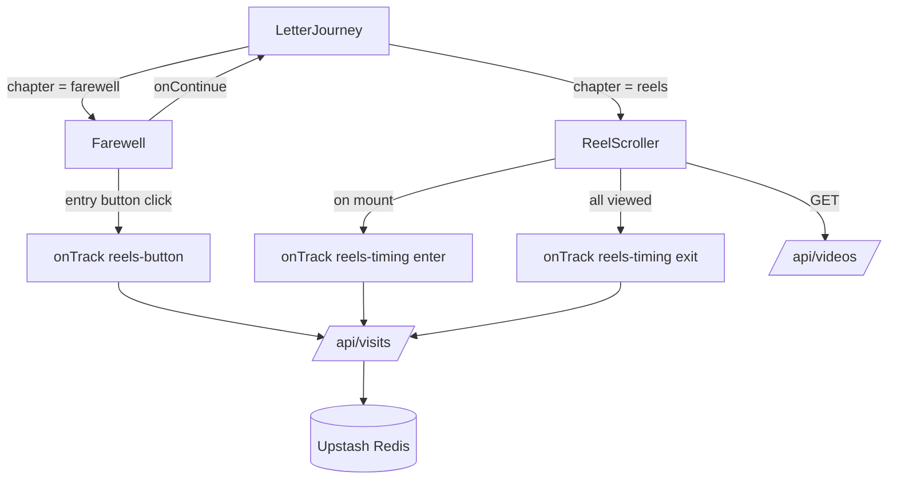
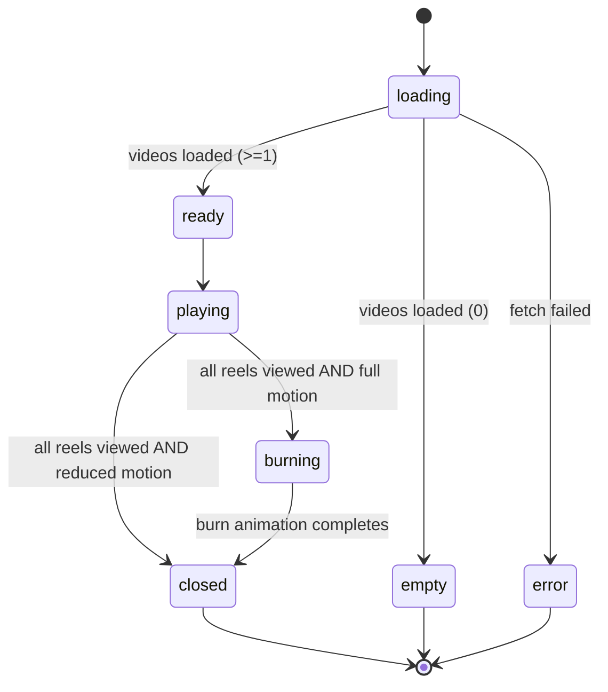

# Design: Vertical Reels and Burn Ending

## Overview

This feature replaces the horizontal Swiper reel chapter with a full-screen, vertical,
auto-advancing video feed styled after Instagram Reels, and ends the letter with an
automatic fire "burn" transition that dissolves into a quiet black closing screen once
every reel has been seen.

The recipient's only input is scrolling. Playback, advancing, the burn, and the ending
all happen automatically. Three consented tracking signals are added to the existing
Upstash Redis logging: the entry-button click on the farewell page, the moment the video
page is entered, and the moment every reel has played at least once.

Key design points, each traced to requirements:

- A new client component `ReelScroller` replaces `ReelOpener` as the sole reel
  experience (Req 2.8). It uses native CSS scroll-snap rather than Swiper, so the Swiper
  dependency and its styles are no longer needed for reels.
- Reels are discovered through the existing `/api/videos` endpoint, unchanged (Req 2.7).
- The farewell page swaps its "Watch a little more" text link for a single small floating
  entry button, shown only when reels exist (Req 1.1, 1.2, 1.3).
- Tracking reuses the existing consent, signed-session, and privacy model; the visits API
  gains two new event types and a phase field, but no new personal data category
  (Req 6.4, NFR 1).

### Research Notes

- **Active-slide detection.** `IntersectionObserver` is the standard, jank-free way to
  learn which snapped slide is on screen. Observing each slide and tracking the entry with
  the highest `intersectionRatio` avoids scroll-event polling. A threshold around `0.6`
  means a slide is "active" only when it substantially fills the viewport, which matches
  the one-reel-per-screen snap model (Req 2.1, 2.2, 2.3, 2.4).
- **Autoplay policy.** Browsers only allow programmatic `video.play()` without a gesture
  when the video is `muted`. Reels therefore play muted with `playsInline` (iOS Safari
  requires `playsInline` to avoid fullscreen takeover). `play()` returns a promise that
  rejects when autoplay is blocked; that rejection is caught and ignored (Error Handling).
- **Scroll-snap.** `scroll-snap-type: y mandatory` on the scroll container plus
  `scroll-snap-align: start` and `height: 100dvh` per slide gives the Instagram feel.
  `100dvh` (dynamic viewport height) avoids the mobile URL-bar gap that `100vh` leaves.
  Programmatic advance uses `element.scrollIntoView({ behavior })` (Req 2.5, 2.6).
- **Reduced motion.** `prefers-reduced-motion` is already surfaced through the project's
  `useReduceMotion` hook. Under reduced motion, autoplay is suppressed, a reel counts as
  viewed once it becomes the active snapped slide, and the burn animation is skipped in
  favour of an instant cut to the closing screen (Req 4.5, NFR 2).

## Architecture

The reel chapter is a self-contained client component mounted by the existing
`LetterJourney` orchestrator. `LetterJourney` continues to own chapter routing and passes
`onTrack` down; the new `ReelScroller` owns everything about playback, viewed-tracking,
the burn transition, and the closing screen.



Internal phase progression inside `ReelScroller`:



Notes:

- `loading`, `ready`, `error`, and `empty` describe data status; `playing`, `burning`,
  `closed` describe the experience phase once data is ready. They are modelled as two
  fields (`status`, `phase`) rather than one enum so the UI can reason about them
  independently.
- The `empty` and `error` states never reach `burning` or `closed`: with no reels there is
  nothing to view, so no burn occurs (Req NFR 3, Error Handling).

## Components and Interfaces

### ReelScroller (new: `src/components/reel-scroller.jsx`)

The sole reel experience. Rendered by `LetterJourney` when `chapter === "reels"`.

```
Props:
  onTrack?: (event) => void   // consented logging passthrough from LetterJourney

Behaviour:
  - On mount: fetch /api/videos; emit onTrack({ type: "reels-timing",
    chapter: "reels", phase: "enter" }).
  - Renders a vertical scroll-snap container, one video slide per 100dvh.
  - Observes slides with IntersectionObserver; the most-visible slide (ratio >= 0.6)
    is the active reel.
  - Active reel: play (muted, playsInline) under full motion; others pause.
  - Renders a PlaybackBar for the active reel.
  - On active reel "ended": scroll the next slide into view; the last reel does not
    advance or loop.
  - On a reel's first "play" while active (full motion) OR on becoming the active
    snapped slide (reduced motion): add video.src to viewedIds.
  - When viewedIds.size === videos.length: emit onTrack({ type: "reels-timing",
    chapter: "reels", phase: "exit" }); set phase = "burning" (full motion) or
    "closed" (reduced motion).
  - phase === "burning": render BurnOverlay over the feed.
  - phase === "closed": render ClosingScreen (terminal).
```

State held by `ReelScroller`:

| Field | Type | Purpose |
| --- | --- | --- |
| `status` | `"loading" \| "ready" \| "error"` | Data-fetch status of `/api/videos` |
| `phase` | `"playing" \| "burning" \| "closed"` | Experience phase once ready |
| `videos` | `Video[]` | Discovered reels (see Data Models) |
| `activeIndex` | `number` | Index of the currently active/snapped reel |
| `viewedIds` | `Set<string>` | `video.src` values that have played at least once |

`empty` is derived (`status === "ready" && videos.length === 0`) rather than stored.

Refs: `videoRefs` (array of `<video>` elements) and `slideRefs` (array of slide wrapper
elements, used by the observer and for `scrollIntoView`), mirroring the existing
`videoRefs` pattern in `ReelOpener`.

### PlaybackBar (internal to ReelScroller)

A labelled `<input type="range">` bound to the active reel (Req 3.1-3.4).

```
Props:
  currentTime: number
  duration: number
  onSeek: (seconds: number) => void

Behaviour:
  - value reflects currentTime; max reflects duration (updated on durationchange).
  - onChange seeks the active video (sets video.currentTime).
  - Keyboard-operable by default (native range input); carries aria-label
    "Video progress" and aria-valuetext of the current position.
```

Progress is driven by listening to the active video's `timeupdate` and `durationchange`
events; the bar re-renders as they fire (Req 3.2).

### BurnOverlay (internal to ReelScroller)

A full-screen overlay that visually consumes the feed with fire, then dissolves to black
(Req 4.3, 4.4).

```
Props:
  onComplete: () => void

Behaviour:
  - Full motion only. Rendered when phase === "burning".
  - CSS keyframe animation: fire gradient rises over the content and fades to black.
  - Calls onComplete on animationend (or a matched timeout fallback), moving
    phase to "closed".
  - Not rendered under reduced motion; the phase goes straight to "closed".
```

### ClosingScreen (internal to ReelScroller)

```
Behaviour:
  - Rendered when phase === "closed".
  - Fixed, full-screen, black background (Req 5.1).
  - Centered text: "Have a happy day ahead. I'll miss you." (Req 5.2).
  - Terminal: no controls, no navigation (Req 5.3).
```

### Farewell (modified: `src/components/farewell.jsx`)

- Remove the `ChapterLink` "Watch a little more" link (Req 1.2).
- Add a single small floating entry button, fixed near the bottom-center, shown only when
  `hasReels` is true (Req 1.1, 1.3). The existing `hasReels` fetch is reused.
- Button is a native `<button>` with an accessible label (e.g. `aria-label="Watch a few
  moments in motion"`), keyboard-focusable and operable by default (Req 1.5).
- On activation: `onTrack?.({ type: "reels-button", chapter: "farewell" })` then
  `onContinue()` (Req 1.4, 6.1).
- The existing "Stay with this a little longer" button is kept; its `reels-choice` "stay"
  tracking is retained.

### LetterJourney (modified: `src/components/letter-journey.jsx`)

- Replace the `ReelOpener` import and render with `ReelScroller`, passing `onTrack`
  (previously `ReelOpener` received nothing).
- Chapter list and atmosphere map are unchanged (`reels` remains the final chapter).

### Visits API (modified: `src/app/api/visits/route.js`)

Extends validation to accept the new events while preserving the existing ones and the
consent/session/privacy model (Req 6, NFR 1).

```
EVENT_TYPES += "reels-button", "reels-timing"
REEL_PHASES = new Set(["enter", "exit"])

Validation:
  - "chapter":       chapter in CHAPTERS, no action, no phase        (existing)
  - "reels-choice":  chapter in CHAPTERS, action in REEL_ACTIONS     (existing)
  - "reels-button":  chapter === "farewell", no action, no phase     (new)
  - "reels-timing":  chapter === "reels", phase in REEL_PHASES, no action  (new)

Record:
  - Adds phase to the stored record for reels-timing events.
  - timestamp remains server-generated (new Date().toISOString()); no client clock
    is trusted (Req 6, "Server timestamps everything").
```

All other behaviour (origin check, signed-session verification, size cap, rate limiting,
device/browser derivation, `lpush` to `birthday:visits`) is unchanged.

## Data Models

### Video (from `/api/videos`, unchanged)

```
Video {
  name: string   // original filename, e.g. "01-park.mp4"
  src:  string   // "/videos/<url-encoded name>", also the viewed-tracking key
  type: string   // "video/mp4" | "video/webm"
}
```

`src` is unique per reel and is used as the identity key in `viewedIds`.

### Client tracking event (POST body to `/api/visits`)

```
// existing
{ type: "chapter",      chapter: Chapter }
{ type: "reels-choice", chapter: Chapter, action: "stay" | "watch" }

// new
{ type: "reels-button", chapter: "farewell" }
{ type: "reels-timing", chapter: "reels", phase: "enter" | "exit" }
```

### Stored visit record (Redis list `birthday:visits`)

```
{
  id: string,             // randomUUID
  type: string,           // event type
  chapter: string,
  action?: string,        // reels-choice only
  phase?: string,         // reels-timing only ("enter" | "exit")
  timestamp: string,      // server ISO time
  session: string,        // HMAC of signed session id
  device: string,         // "desktop" | "mobile" | "tablet"
  browser: string
}
```

No IP address and no precise location are stored, consistent with the current record
shape (Req 6.4, NFR 1).

## Correctness Properties

*A property is a characteristic or behavior that should hold true across all valid
executions of a system - essentially, a formal statement about what the system should do.
Properties serve as the bridge between human-readable specifications and machine-verifiable
correctness guarantees.*

Most of this feature is UI rendering, browser-driven scroll-snap and autoplay,
fire-and-forget side effects, and external I/O, which are covered by example, snapshot,
and mock-based tests (see Testing Strategy). Three pure-logic pieces are input-varying and
suitable for property-based testing: the viewed-set completion logic, the phase decision,
and the visits API event validator. These are the only correctness properties.

### Property 1: Viewed-set completion and idempotence

For any list of reels (each with a unique `src`) and any sequence of view events over
those reels, marking a reel viewed adds its `src` to the viewed set without removing any
other, marking an already-viewed reel again leaves the set unchanged (idempotence), and
"all viewed" is true if and only if every reel `src` appears in the viewed set at least
once.

**Validates: Requirements 4.1**

### Property 2: Phase decision is a total function of viewed state and motion preference

For any list of reels, any viewed set, and any reduced-motion preference, the next phase
is determined as follows: if not all reels are viewed the phase remains `playing`; if all
reels are viewed and reduced motion is off the phase becomes `burning`; if all reels are
viewed and reduced motion is on the phase becomes `closed` (never `burning`). Under every
input the closing screen is eventually reachable when all reels are viewed.

**Validates: Requirements 4.2, 4.5**

### Property 3: Visits API accepts an event if and only if it conforms to its schema

For any generated event payload, the visits API validator accepts the payload if and only
if it matches exactly one allowed shape: `chapter` with a valid chapter and no
action/phase; `reels-choice` with a valid chapter and an action in the allowed set;
`reels-button` with chapter `farewell` and no action/phase; or `reels-timing` with chapter
`reels`, a phase in the allowed set, and no action. All other payloads (unknown type,
wrong chapter, missing or extra fields, invalid action or phase) are rejected.

**Validates: Requirements 6.4**

## Error Handling

- **No reels discovered** (`/api/videos` returns an empty list): the farewell page omits
  the entry button (Req 1.3, NFR 3), and if the reel chapter is reached directly it shows
  a calm empty state and never begins the burn (Req NFR 3). The experience ends at the
  existing farewell state.
- **Video discovery fails** (`/api/videos` errors or network failure): `ReelScroller`
  enters `status = "error"` and shows a quiet message; no reels render and no burn occurs.
- **Autoplay rejected** (browser blocks `video.play()`): the rejected promise is caught and
  ignored. Under full motion the reel simply does not auto-start; the reel still counts as
  viewed when it becomes the active snapped slide, so completion is still reachable
  (Req 4.1). Under reduced motion autoplay is intentionally suppressed and viewed-marking
  is driven entirely by becoming the active slide (Req 4.5).
- **Tracking failures** (POST to `/api/visits` rejected, rate-limited, or offline): all
  tracking is fire-and-forget. A failed or blocked event never interrupts playback, the
  burn, or the closing screen, and errors are swallowed (Req 6, NFR 1).
- **Consent declined**: the tracking sender emits nothing, so no `reels-button` or
  `reels-timing` event is sent (Req 6.5).
- **Malformed tracking payloads at the server**: the visits API rejects with `400` and
  stores nothing (Property 3), while the existing origin, session, size, and rate-limit
  guards continue to apply.
- **Burn animation never fires `animationend`** (interrupted or unsupported): a timeout
  fallback matched to the animation duration still calls `onComplete`, so the closing
  screen is always reached after the burn begins (Req 4.4).

## Testing Strategy

This feature is dominated by UI rendering, browser-driven behavior (scroll-snap,
autoplay, `IntersectionObserver`), side-effect-only tracking, and external I/O, so
example-based, snapshot, and mock-based tests carry most of the coverage. Property-based
tests apply only to the three pure-logic properties above.

### Unit and example-based tests

- **Farewell**: entry button shown only when reels exist (Req 1.1, 1.3); old
  "Watch a little more" link removed (Req 1.2); click calls `onContinue` and emits
  `onTrack({ type: "reels-button", chapter: "farewell" })` (Req 1.4, 6.1); button is a
  labelled, focusable native `<button>` (Req 1.5).
- **ReelScroller wiring**: on mount emits `reels-timing`/`enter` once (Req 6.2); active
  slide plays and others pause via mocked `play`/`pause` (Req 2.3, 2.4); active reel
  `ended` scrolls the next slide in and the last reel does not advance or loop
  (Req 2.5, 2.6, edge case); reaching all-viewed emits `reels-timing`/`exit` exactly once
  (Req 6.3) and never emits a burn/closing event (Req 6.6).
- **PlaybackBar**: present for the active reel (Req 3.1); value tracks `timeupdate`
  (Req 3.2); changing the value seeks the active video (Req 3.3); carries an accessible
  label and is a native range input (Req 3.4).
- **BurnOverlay / ClosingScreen**: burn `animationend` (and the timeout fallback) moves to
  the closing screen (Req 4.4); closing screen has a black background, the exact copy
  "Have a happy day ahead. I'll miss you.", and no navigation controls (Req 5.1, 5.2, 5.3).
- **Consent guard**: with consent declined, no tracking events are sent (Req 6.5).
- **Visits API record shape**: a stored `reels-timing` record includes `phase` and the
  server-generated `timestamp`, and no record contains an IP or location field (Req 6.4).

### Snapshot / structural tests

- One portrait slide per `100dvh` with scroll-snap styling (Req 2.1).
- `LetterJourney` renders `ReelScroller` (not `ReelOpener`) for the reels chapter, and
  `ReelOpener` is removed (Req 2.8).

### Integration / manual verification

- Scroll-snap settling on a single reel and the fire animation reading as fire are
  browser-visual behaviors verified manually or via end-to-end review (Req 2.2, 4.3).
- Reels are sourced from `public/videos` through the existing `/api/videos` endpoint
  (Req 2.7), verified with the endpoint mocked in unit tests and confirmed end to end.

### Property-based tests

The project currently has no test runner configured. When implementing these properties,
add a JavaScript property-based testing library (`fast-check`) alongside a test runner
(`vitest`) rather than implementing property testing from scratch. The pure-logic helpers
(viewed-set update, `allViewed`, `nextPhase`, and the visits event validator) should be
extracted so they can be tested directly without a browser.

- Each property-based test MUST run a minimum of 100 iterations.
- Each test MUST be tagged with a comment referencing its design property, using the
  format: **Feature: vertical-reels-and-burn-ending, Property {number}: {property_text}**.
- Each correctness property MUST be implemented by a SINGLE property-based test:
  - Property 1 -> viewed-set completeness and idempotence over generated reel lists and
    view-event sequences.
  - Property 2 -> `nextPhase(viewedIds, videos, reduceMotion)` decision over generated
    inputs.
  - Property 3 -> visits API event validator accepts iff conforming, over generated
    payloads including malformed ones.
